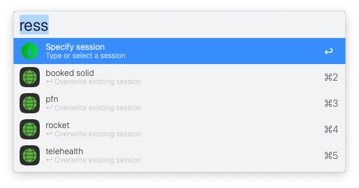
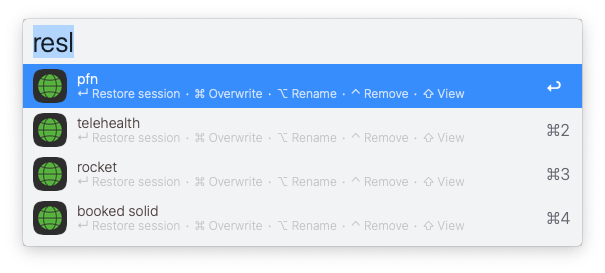

# Restore It!

Save & restore all browser windows & tabs to keep control of endless webpages on your screen(s).

Works with: `Chrome, Brave, Safari, Arc & Edge Browsers`

▸ Requires [jq](https://formulae.brew.sh/formula/jq)

> *See Restore It!'s workflow-brother, [Tag It!](https://github.com/modrocko/tag-it)*

## Usage

### Save session

Get your browser windows & tabs just perfect on your screen(s). 

Then... 1) Invoke this workflow 2) Name it 3) Hit enter

Everything saved to restore this session later on. No need to keep open countless tabs for *all* your projects. 

 

### Restore session

Invoke this Alfred feature anytime you want to work on that project again. This time without any eye or brain clutter.

 

### It's that easy!
